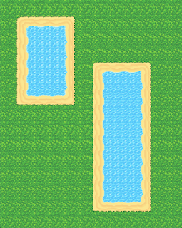
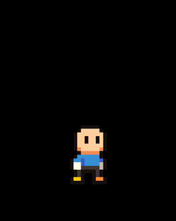
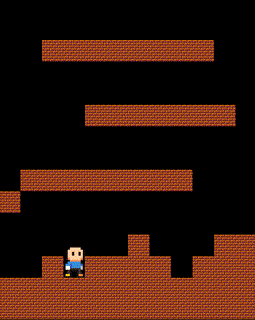
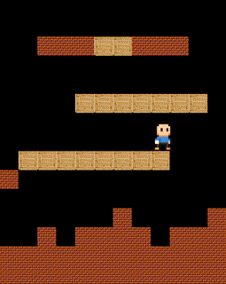
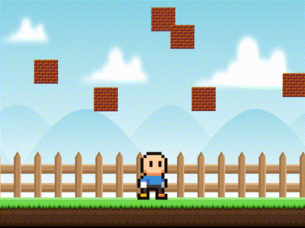
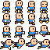
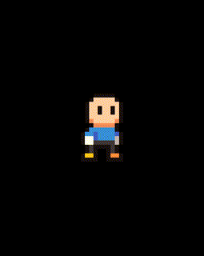
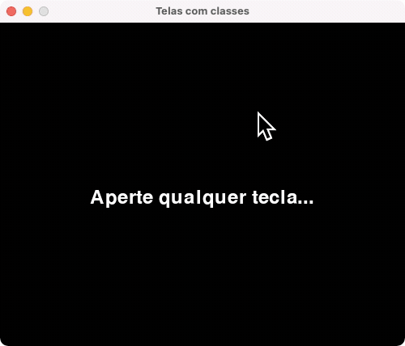

# Exemplos de Código em PyGame

## Construindo mapas com tiles

_Tiles_ permitem a construção de mapas através do nosso código. Ao invés de termos uma grande imagem para o fundo podemos construir um mapa a partir de unidades menores (os _tiles_). Isso nos dá algumas vantagens:

- Flexibilização dos mapas: podemos construir quantos mapas quisermos sem ter que gerar uma imagem diferente para cada um;
- Controle de colisão: podemos tratar alguns tiles de maneira especial fazendo um tratamento de colisão. Alguns exemplos:
  - Podemos impedir que o jogador passe por aquele ponto, criando tiles de parede ou chão, por exemplo (ver [jump_block.py](jump_block.py));
  - Podemos criar tipos de terrenos distintos (verificamos quais tiles colidiram com o jogador e assim modificamos sua velocidade);
- Mapa em camadas: podemos desenhar um tile sobre o outro, por exemplo, com um tile de arbusto sobre um tile de terra. Assim, quando o jogador corta o arbusto ele some, mas o de terra permanece.
- As possibilidades são infinitas, use sua criatividade!

Um exemplo de tiles com PyGame é apresentado em [tiles/jogo.py](tiles/jogo.py) (também existe uma [versão sem classes](tiles/jogo_sem_classes.py)).

## Fazendo o personagem pular

Vamos apresentar alguns exemplos de como fazer o personagem pular ao apertarmos a tecla `ESPAÇO` ou a seta para cima. No primeiro exemplo ([jump.py](jump.py)) temos uma versão simplificada, assumindo que o chão está fixo em uma determinada altura.

Nesse primeiro exemplo, precisamos guardar uma variável com o estado do personagem. Se ele já estiver pulando, ele não pode pular novamente. Se ele estiver parado, ele pode pular.

No segundo exemplo ([jump_block.py](jump_block.py)), adicionamos blocos que impedem o jogador de passar. Para entender melhor o posicionamento dos blocos, veja os exemplos de _tiles_. A cada `update` atualizamos a posição `x` e `y` separadamente. Se o jogador colidir com um bloco depois de atualizarmos a posição horizontal, reposicionamos o seu `x` baseado na localização do bloco colidido e no sentido na direção horizontal que o jogador estava andando. Se o jogador colidir depois de atualizarmos a posição vertical, reposicionamos seu `y` baseado na localização do bloco e no sentido na direção vertical do jogador.

Em jogos de plataforma é comum termos alguns tipos de obstáculo que podem ser transpassados quando o jogador está pulando, mas "seguram" o jogador quando ele está caindo. O terceiro exemplo ([jump_platform.py](jump_platform.py)) mostra como podemos fazer isso. A cada `update`, se o jogador estiver pulando ou parado sobre uma plataforma, atualizamos a sua posição vertical no mapa. Assim, quando o jogador está caindo verificamos se a sua última posição antes de cair era maior do que as plataformas com as quais ele está colidindo. Nesse caso fazemos com que ele pare. Essa verificação da altura é importante, pois caso o jogador pule, mas não ultrapasse a altura da plataforma, ele não deve ser transportado para cima da plataforma durante a colisão.

## Movendo o fundo

É comum utilizarmos imagens cíclicas para representar o fundo do jogo, ou seja, imagens cujo lado direito e esquerdo se conectam. Assim podemos simular um fundo infinito em movimento com apenas uma imagem.

A ideia é desenharmos sempre a imagem do fundo e uma cópia logo em seguida. A cada frame atualizamos a posição do fundo da imagem para simular o movimento. Além disso, quando o fundo sai da tela por completo, precisamos reposicioná-lo próximo à sua posição original. O arquivo [moving_brackground.py](moving_background.py) mostra como fazer isso.

Nesse mesmo exemplo também mostramos como atualizar as posições dos objetos localizados no mundo. Caso queira modificar a velocidade do mundo ao longo do jogo, é necessário percorrer o grupo de sprites do mundo atualizando a sua velocidade.

Finalmente, podemos criar um efeito de [paralaxe](https://en.wikipedia.org/wiki/Parallax) utilizando algumas camadas de imagens de fundo. Obtemos o efeito de paralaxe ao movimentar cada camada com uma velocidade diferente: as mais próximas se movem mais rapidamente e as mais distantes se movem mais lentamente. O arquivo [moving_background_parallax.py](moving_background_parallax.py) mostra como implementar o efeito de paralaxe.

Podemos também deixar o controle do movimento nas mãos do jogador. De modo geral, existem três maneiras de mover o jogador pelo mundo:

1. O mundo fica parado e o jogador se move;
2. O mundo se move e o jogador fica parado;
3. O mundo se move e o jogador também se move;

A terceira alternativa é uma combinação das duas primeiras. O arquivo [moving_background_fixed_player.py](moving_background_fixed_player.py) mostra como implementar a segunda opção, movendo somente no eixo x. O personagem possui um atributo com a velocidade em x, controlada pelo teclado. Entretanto, a velocidade em x não é utilizada para atualizar a posição do jogador, mas sim do fundo e dos objetos no mundo. Para simular o efeito de movimento, aplicamos a velocidade no sentido oposto ao do jogador. Ou seja, o jogador se mover para a direita enquanto o mundo está parado é equivalente ao mundo se mover para a esquerda enquanto o jogador está parado.

## Alternando animações com sprite sheets

Um sprite sheet é uma imagem que é composta por diversos sprites do nosso jogo. É comum utilizarmos sprite sheets para armazenar sequências de quadros de uma animação. Um exemplo é a imagem a seguir:

Podemos dividir esse sprite sheet em 5 animações: personagem parado (primeira linha), personagem correndo (1a a 3a imagens da segunda linha), personagem pulando (4a imagem da segunda linha), personagem lutando (terceira linha) e personagem nadando (quarta linha).

No arquivo [spritesheet.py](spritesheet.py) mostramos como usar um sprite sheet para animar um personagem dependendo do seu estado atual.

## Rotacionando o personagem de acordo com a posição do mouse

O arquivo [rotate_with_mouse.py](rotate_with_mouse.py) mostra como podemos rotacionar a imagem do personagem baseado na diferença entre a posição atual do mouse, obtida com a função `pygame.mouse.get_pos()`, e a posição do personagem.

## Alternando textos

Textos também são renderizados como imagens. O texto será desenhado na tela em diversos frames em sequência. No arquivo [text_animation.py](text_animation.py) mostramos como apresentar textos em sequência. Quando o usuário aperta a tecla ESPAÇO o próximo texto é apresentado.

## Menu de texto

No arquivo [text_menu.py](text_menu.py) apresentamos um exemplo de um menu de texto. Para compreender o código, estude primeiro o exemplo do [text_animation.py](text_animation.py).

# Múltiplas telas e classes

No arquivo [multiple_screens.py](multiple_screens.py) apresentamos um exemplo de múltiplas telas utilizando classes.

# Referências

- [`hero.png`](img/hero.png): [https://opengameart.org/content/classic-hero](https://opengameart.org/content/classic-hero)
- [`32x32_map_tile v3.1 [MARGINLESS].png`](img/32x32_map_tile%20v3.1%20[MARGINLESS].png): [https://opengameart.org/content/basic-map-32x32-by-silver-iv](https://opengameart.org/content/basic-map-32x32-by-silver-iv)
- [`Fence Game Background for game developers.zip`](img/Fence%20Game%20Background%20for%20game%20developers.zip): [https://opengameart.org/content/bevouliin-free-fence-game-background-for-game-developers](https://opengameart.org/content/bevouliin-free-fence-game-background-for-game-developers)
